```{r}
library("tidyverse")
library("pheatmap")
library("dbscan")
library("vegan")


abundance <- tibble('Bruant familier' = c(1, 0, 0, 3),
                    'Citelle à poitrine rousse' = c(1, 0, 0, 0),
                    'Colibri à gorge rubis' = c(0, 1, 0, 0),
                    'Geai bleu' = c(3, 2, 0, 0),
                    'Bruant chanteur' = c(1, 0, 5, 2),
                    'Chardonneret' = c(0, 9, 6, 0),
                    'Bruant à gorge blanche' = c(1, 0, 0, 0),
                    'Mésange à tête noire' = c(20, 1, 1, 0),
                    'Jaseur boréal' = c(66, 0, 0, 0))
                    
occurence <- abundance %>%
  transmute_all(funs(if_else(. > 0, 1, 0)))
  
df_mcinnes <- read_csv("data/clusterable_data.csv", col_names = c("x", "y"), skip = 1)

data("iris")
```

## Analyse d'associations
**Association**. Mesure pour quantifier la ressemblance (ou la différence) entre deux objets (échantillons) ou variables (descripteurs) numériques, ${\rm I\!R}$, d'abondance (${\rm I\!N}$), d'occurrence ($[0, 1]$), de catégories, etc.

## Mode R et mode Q
**Mode R**. Association entre variables (e.g. corrélation, covariance).

**Mode Q**. Association entre observations (e.g. similarité, distance).

## Distance vs dissimilarité

La distance est de 0 pour des objets identiques et augmente avec la différence.

La similarité (= 1 - dissimilarité) est de 0 pour les objets n'ayant aucun lien et de 1 pour une association parfaite.

## Exemple de matrice de distance

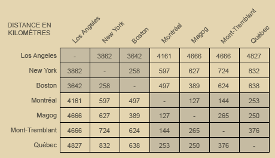

## Exemple de données d'abondance

```{r}
abundance
```

## Exemple de données d'occurence

```{r}
occurence
```

## Dissimilarité d'abondance


## Dissimilarité de Bray-Curtis

```{r}
bray_curtis <- vegdist(abundance, method = "bray") # ?vegdist
pheatmap(bray_curtis, display_numbers = round(bray_curtis, 2)) # library("pheatmap")
```

## Dissimilarité d'occurence

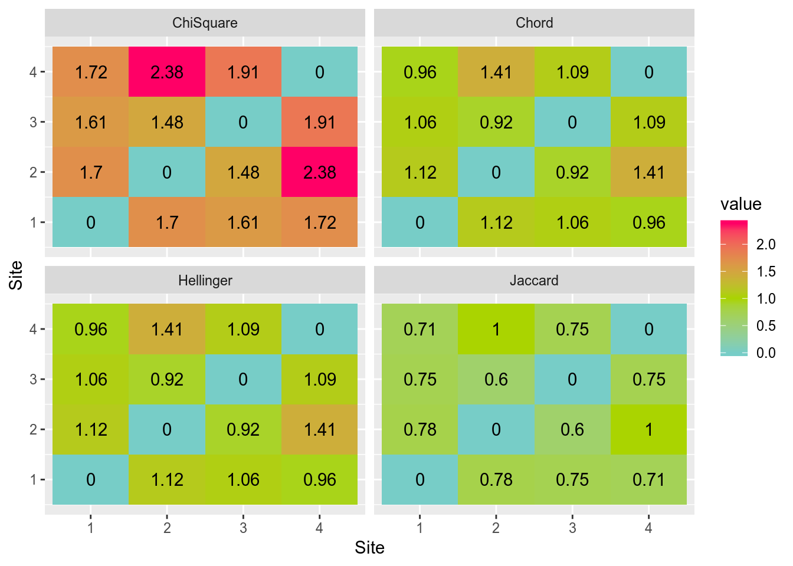

## Dissimilarité du $\chi^2$

```{r}
chi_square <- dist(decostand(occurence, method="chi.square")) # ?decostand
```

## Dissimilarité quantitative

- Euclidienne: attention à l'échelle
- Mahalanobis: inclu la covariance
- Manhattan: attention à l'échelle (gradients orthogonaux)
- Aitchison: données compositionnelles

## Dissimilarité mixtes
Distance de *Gower*: Jaccard (occurrence et catégories) + Manhattan. --> voir notes de cours.

## Quelle métrique choisir?

1. Type de données: abondance, occurrence, numérique, mixte
2. Pas de réponse claire:
- Consulter l'expérience dans la littérature
- Comparer l'équation mathématique à la question statistique

## Partitionnement (1/)
Catégoriser des objets qui n'appartiennent *a priori* à aucune catégori pour faire en sorte que les différences entre les groupes soient plus grande que les différences entre les objets d'un groupe.

## Partitionnement (2/)

- Critère d'association entre les groupes
- Nombre de groupe à créer
- Possibilité qu'une donnée n'appartienne à aucun groupe

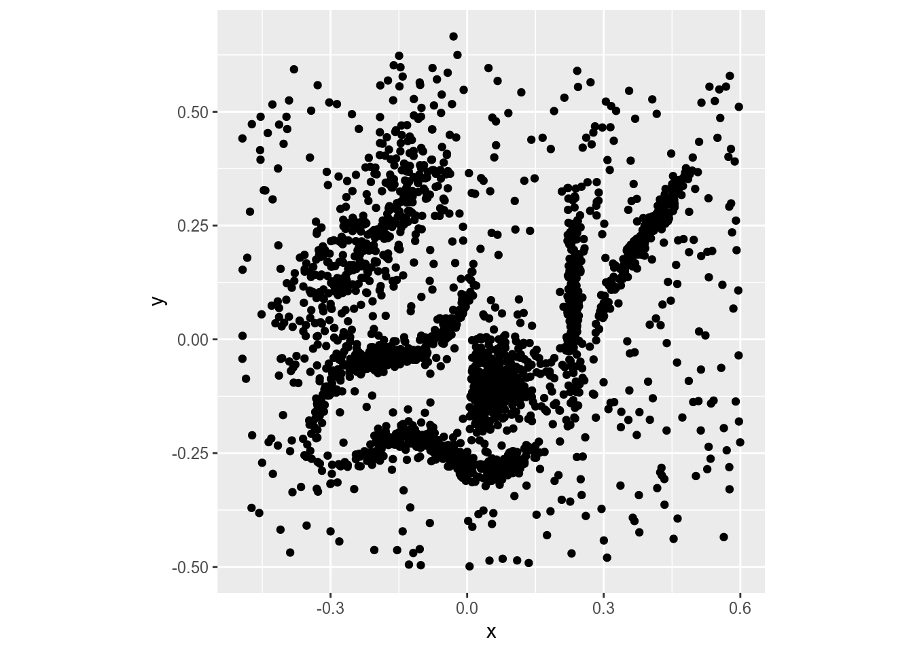
## Partitionnement (3/)

Deux types:
- Non-hiérarchique: groupes non ordonnés (nombre de groupes *a priori*)
- Hiérarchique: séquence de groupes et de sous-groupes (nombre de groupes *a posteriori*)

## Non-hiérarchique: les *k-means* (1/)
Pour la plupart des algorithmes, les *k-means* se basent sur la distance euclidienne (mettre à l'échelle).

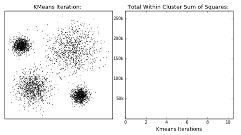
## Non-hiérarchique: les *k-means* (2/)

```{r}
mcinnes_kmeans <- cascadeKM(df_mcinnes, inf.gr = 3, sup.gr = 10, criterion = "calinski")
plot(mcinnes_kmeans)
```

## Non-hiérarchique: les *k-means* (3/)

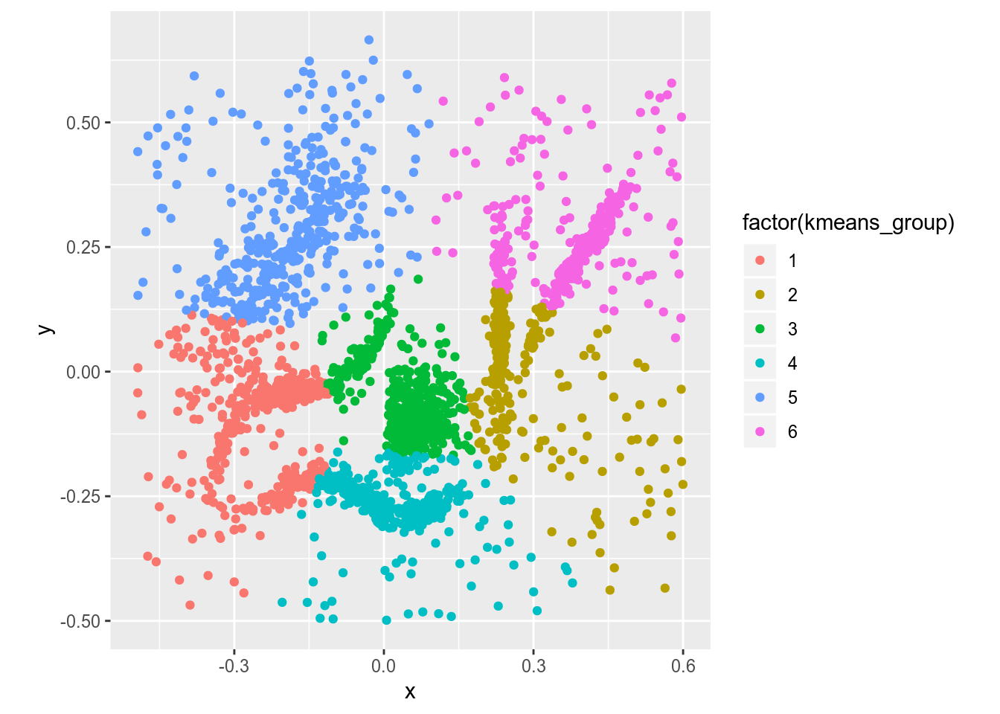


## Non-hiérarchique: *dbscan* (1/)

**dbscan**:  Density-Based Spatial Clustering of Applications with Noise
Les groupes sont composés de zones où l’on retrouve plus de points (zones denses) séparées par des zones de faible densité.

## Non-hiérarchique: *dbscan* (2/)

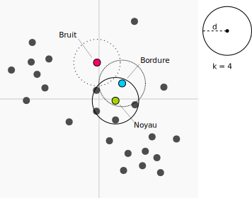

## Non-hiérarchique: *dbscan* (3/)

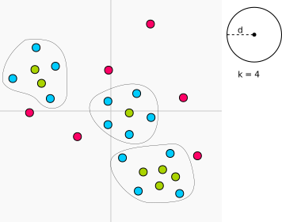

## Non-hiérarchique: *dbscan* (4/)

```{r}
mcinnes_dbscan <- dbscan(x = vegdist(df_mcinnes[, ], method = "euclidean"),
                         eps = 0.03, minPts = 10) # library("dbscan")
dbscan_group <- mcinnes_dbscan$cluster
```

## Non-hiérarchique: *dbscan* (5/)

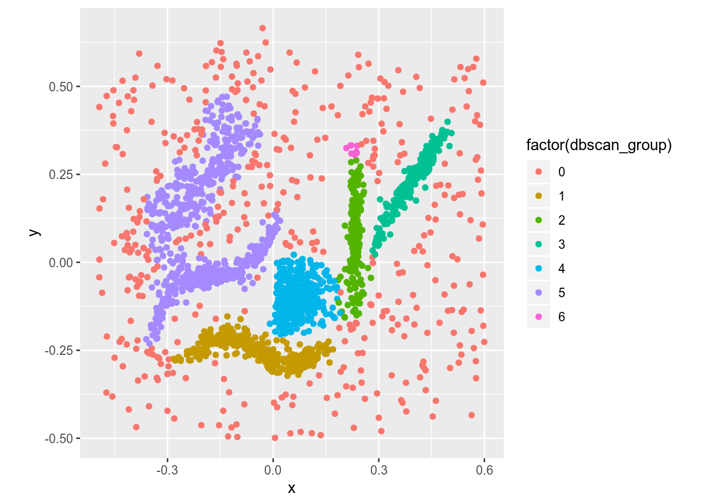
## Hiérarchique: *hclust* (1/)
Basé sur les matrices d'association, puis sur différentes approches.

- **Single link**. Les groupes sont agglomérés sur la base des deux points parmi les groupes, qui sont les plus proches.
- **Complete link**. À la différence de la méthode single, on considère comme critère d’agglomération les éléments les plus éloignés de chaque groupe.
- **Agglomération centrale**. Il s’agit d’une famille de méthodes basées sur les différences entre les tendances centrales des objets ou des groupes.
- **Ward**. L’optimisation vise à minimiser les sommes des carrés par regroupement.

Choix de la meilleure méthode: corrélation cophénétique --> voir les notes de cours.

## Hiérarchique: *hclust* (2/)

```{r}
mcinnes_hclust_distmat <- vegdist(df_mcinnes, method = "manhattan")
mcinnes_hclust <- hclust(mcinnes_hclust_distmat, method = "average")
plot(mcinnes_hclust)
```

## Hiérarchique: *hclust* (2/)
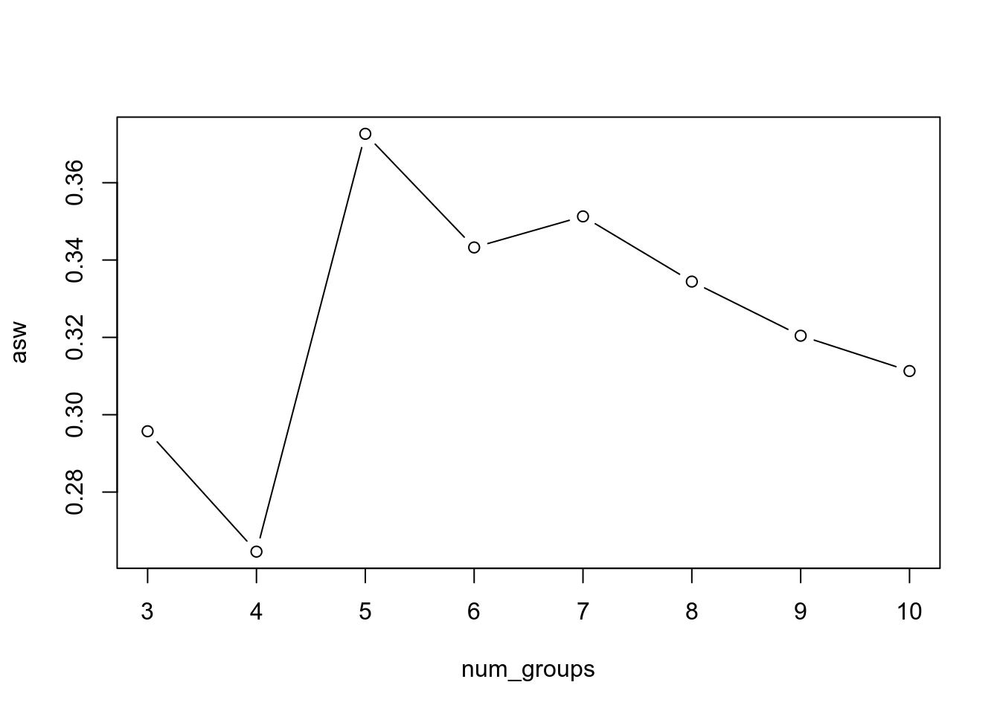
## Hiérarchique: *hclust* (3/)

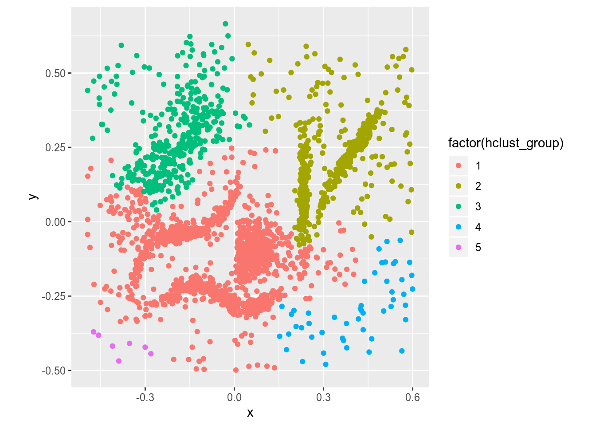
## Hiérarchique: *hdbscan* (1/)

Idem *dbscan*, mais la distance critique est successivement augmentée.

```{r}
mcinnes_hdbscan <- hdbscan(x = vegdist(df_mcinnes, method = "euclidean"),
                           minPts = 20,
                           gen_hdbscan_tree = TRUE,
                           gen_simplified_tree = FALSE)
hdbscan_group <- mcinnes_hdbscan$cluster
```

## Hiérarchique: *hdbscan* (2/)

```{r}
plot(mcinnes_hdbscan$hdbscan_tree)
```

## Hiérarchique: *hdbscan* (3/)
Nombre minimum d’objets par groupe de 20 (`minPts = 20`).

```{r}
plot(mcinnes_hdbscan)
```

## Résultat des partitionnements


## Pas toujours facile

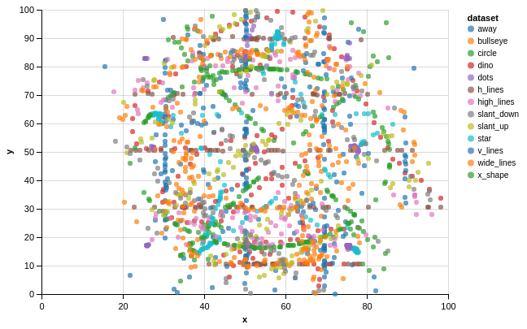

## Ordination

Réduction d'axe pour mettre de l’ordre dans des données dont le nombre élevé de variables peut amener à des difficultés d’interprétaion.

- Non-contraignante
- Contraignante

## Ordination non-contraignante

| Méthode | Distance préservée | Variables |
|---|---|---|
| Analyse en composantes principales (ACP) | Distance euclidienne | Données quantitatives, relations linéaires (attention aux double-zéros) |
| Analyse de correspondance (AC) | Distance de $\chi^2$ | Données non-négatives, dimentionnellement homogènes ou binaires, abondance ou occurence |
| Positionnement multidimensionnel (PoMd) | Toute mesure de dissimilarité | Données quantitatives, qualitatives nominales/ordinales ou mixtes |

## Analyse en composantes principales (1/)

Un sommaire d'un espace multidimensionnel en moindres dimensions (généralement 2). Les axes principaux sont orthogonales et construites par combinaisons linéaires des variables.

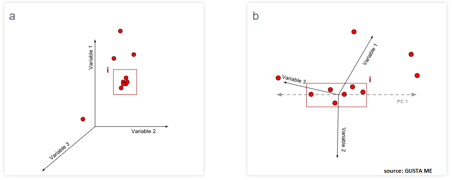

## Analyse en composantes principales (2/)

Explorer la variabilité des points, la redondance des variables, des potentiels regroupements, des valeurs aberrantes, etc.

## Analyse en composantes principales (3/)

```{r}
iris_pca <- rda(iris, scale = TRUE)
plot(iris_pca, scaling = 2)
```